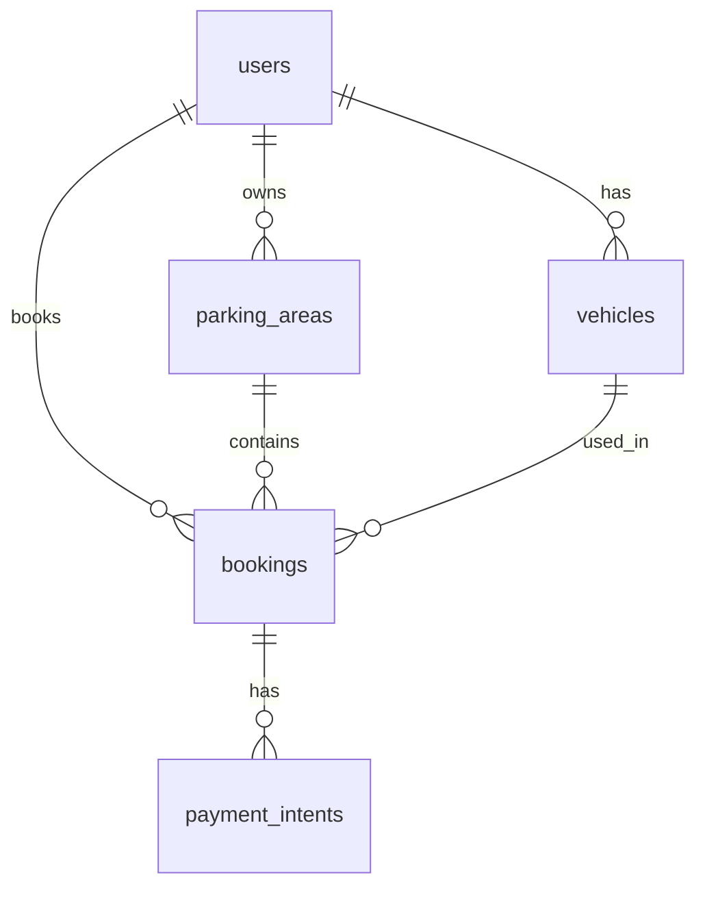

# Smart Parking — PostgreSQL Database Schema (Detailed)

This document describes the relational schema used by the Smart Parking backend. The canonical DDL lives in **`schema.sql`** in this folder; the server applies it on startup via `initSchema()` (`CREATE IF NOT EXISTS`).

**Database:** typically `smart_parking` (set `PG_DATABASE` in `backend/.env`).  
**Engine:** PostgreSQL 12+ recommended (uses `JSONB`, `TIMESTAMPTZ`, `BIGINT`).

---

## 1. Entity relationship (overview)



**Cascade deletes:** If a `users` row is deleted, dependent `parking_areas`, `vehicles`, and `bookings` are removed (see FK definitions). If a `bookings` row is deleted, its `payment_intents` rows are removed.

---

## 2. Table: `users`

Application accounts (drivers, owners, and historically camera operators stored as users; kiosk camera auth may use JWT without a row here).

| Column           | Type              | Nullable | Default   | Description |
|------------------|-------------------|----------|-----------|-------------|
| `id`             | `TEXT`            | NO       | —         | Primary key (app-generated string, often timestamp-based). |
| `email`          | `TEXT`            | NO       | —         | Login email; **globally unique** (`users_email_unique`). |
| `password`       | `TEXT`            | NO       | —         | Bcrypt hash (never store plaintext). |
| `role`           | `TEXT`            | NO       | —         | App role, e.g. `user`, `owner`, `camera-in`, `camera-out`. |
| `name`           | `TEXT`            | YES      | —         | Display name. |
| `phone`          | `TEXT`            | YES      | —         | Contact number. |
| `wallet_balance` | `NUMERIC(12,2)`   | YES      | —         | Wallet for role `user`; often `NULL` for owners. |
| `created_at`     | `TIMESTAMPTZ`     | NO       | `NOW()`   | Account creation time. |

**Constraints**

- `PRIMARY KEY (id)`
- `UNIQUE (email)`

**Indexes**

| Index                     | Columns        | Purpose                          |
|---------------------------|----------------|----------------------------------|
| `idx_users_role`          | `role`         | Filter by role.                  |
| `idx_users_email_lower`   | `LOWER(email)` | Case-insensitive email lookups.  |

---

## 3. Table: `parking_areas`

A parking lot owned by one user (`owner_id`). Layout and slot state are stored as **JSONB** for flexibility (grid + slot assignment).

| Column           | Type              | Nullable | Default   | Description |
|------------------|-------------------|----------|-----------|-------------|
| `id`             | `TEXT`            | NO       | —         | Primary key. |
| `owner_id`       | `TEXT`            | NO       | —         | FK → `users(id)` **ON DELETE CASCADE**. |
| `name`           | `TEXT`            | NO       | —         | Lot display name. |
| `location`       | `TEXT`            | YES      | —         | Address / area description. |
| `layout_matrix`  | `JSONB`           | NO       | —         | 2D grid: cell values `0` = path, `1` = slot, etc. (see §7). |
| `entry_point`    | `JSONB`           | NO       | —         | `{ "row": number, "col": number }`. |
| `slots`          | `JSONB`           | NO       | —         | Array of slot objects with status, distance, etc. (see §7). |
| `total_slots`    | `INT`             | NO       | `0`       | Count of slots (denormalized; should match `slots` length). |
| `price_per_hour` | `NUMERIC(10,2)`   | NO       | `0`       | Hourly rate in INR (or app currency). |
| `vehicle_types`  | `JSONB`           | NO       | `'[]'`    | JSON array of allowed types, e.g. `["Car","SUV"]`. |
| `timings`        | `TEXT`            | YES      | —         | Human-readable hours, e.g. `24/7`. |
| `created_at`     | `TIMESTAMPTZ`     | NO       | `NOW()`   | Row creation time. |

**Indexes**

- `idx_parking_areas_owner` on `(owner_id)` — list lots by owner.

---

## 4. Table: `vehicles`

Vehicles registered to a **parking user** (`user_id`). Plate lookup for camera punch in/out is case-insensitive in the app (`UPPER(vehicle_number)`).

| Column            | Type          | Nullable | Default | Description |
|-------------------|---------------|----------|---------|-------------|
| `id`              | `TEXT`        | NO       | —       | Primary key. |
| `user_id`         | `TEXT`        | NO       | —       | FK → `users(id)` **ON DELETE CASCADE**. |
| `vehicle_number`  | `TEXT`        | NO       | —       | Plate / registration (unique per user). |
| `vehicle_type`    | `TEXT`        | YES      | —       | e.g. Car, SUV. |
| `model`           | `TEXT`        | YES      | —       | Vehicle model. |
| `created_at`      | `TIMESTAMPTZ` | NO       | `NOW()` | Registration time. |

**Constraints**

- `PRIMARY KEY (id)`
- `UNIQUE (user_id, vehicle_number)` — `vehicles_user_plate_unique`

**Indexes**

- `idx_vehicles_number` on `(UPPER(vehicle_number))` — fast plate resolution.

---

## 5. Table: `bookings`

A reservation or camera session: ties **user**, **lot**, **slot**, and **vehicle**. Supports manual bookings and camera punch-in/out flows.

| Column              | Type              | Nullable | Default   | Description |
|---------------------|-------------------|----------|-----------|-------------|
| `id`                | `TEXT`            | NO       | —         | Primary key. |
| `user_id`           | `TEXT`            | NO       | —         | FK → `users(id)` **ON DELETE CASCADE** (vehicle owner). |
| `parking_area_id`   | `TEXT`            | NO       | —         | FK → `parking_areas(id)` **ON DELETE CASCADE**. |
| `slot_id`           | `TEXT`            | NO       | —         | Matches a slot `id` inside `parking_areas.slots` JSON. |
| `vehicle_id`        | `TEXT`            | NO       | —         | FK → `vehicles(id)` **ON DELETE CASCADE**. |
| `start_time`        | `TIMESTAMPTZ`     | YES      | —         | Planned or actual start (manual booking). |
| `end_time`          | `TIMESTAMPTZ`     | YES      | —         | End time when completed. |
| `hours`             | `NUMERIC(10,2)`   | YES      | —         | Duration in hours (computed on checkout). |
| `total_price`       | `NUMERIC(12,2)`   | YES      | —         | Charged amount (INR). |
| `status`            | `TEXT`            | NO       | —         | e.g. `active`, `completed`, `cancelled`. |
| `punch_in_time`     | `TIMESTAMPTZ`     | YES      | —         | Camera / gate punch-in timestamp. |
| `punch_out_time`    | `TIMESTAMPTZ`     | YES      | —         | Camera / gate punch-out timestamp. |
| `punch_type`        | `TEXT`            | YES      | —         | e.g. `camera` when created via punch-in API. |
| `payment_status`    | `TEXT`            | YES      | —         | e.g. `paid` after wallet or card flow. |
| `payment_intent_id` | `TEXT`            | YES      | —         | Reference to Stripe-simulated intent or `wallet_*` id. |
| `paid_amount`       | `NUMERIC(12,2)`   | YES      | —         | Amount paid. |
| `paid_at`           | `TIMESTAMPTZ`     | YES      | —         | Payment timestamp. |
| `imported`          | `BOOLEAN`         | NO       | `FALSE`   | Seeded from CSV when true. |
| `import_ref`        | `TEXT`            | YES      | —         | Optional external reference from import. |
| `created_at`        | `TIMESTAMPTZ`     | NO       | `NOW()`   | Row creation time. |

**Indexes**

| Index                  | Columns           | Purpose                |
|------------------------|-------------------|------------------------|
| `idx_bookings_user`    | `user_id`         | User booking history.  |
| `idx_bookings_area`    | `parking_area_id` | Owner / area analytics.|
| `idx_bookings_vehicle` | `vehicle_id`      | Active booking lookup. |
| `idx_bookings_status`  | `status`          | Filter active/completed.|

---

## 6. Table: `payment_intents`

Simulated payment intents (Stripe-style) linked to a booking. Amounts are stored in **paise** (integer) in `amount_paise`.

| Column               | Type          | Nullable | Default  | Description |
|----------------------|---------------|----------|----------|-------------|
| `id`                 | `TEXT`        | NO       | —        | Primary key (e.g. `pi_*`). |
| `amount_paise`       | `INT`         | NO       | —        | Amount in smallest currency unit (paise). |
| `currency`           | `TEXT`        | NO       | `inr`    | Currency code. |
| `status`             | `TEXT`        | NO       | —        | e.g. `requires_payment_method`, `succeeded`. |
| `client_secret`      | `TEXT`        | YES      | —        | Simulated client secret. |
| `created_ms`         | `BIGINT`       | YES      | —        | Creation time in milliseconds (epoch). |
| `payment_method_id`  | `TEXT`        | YES      | —        | Set on confirm (simulation). |
| `paid_at`            | `TIMESTAMPTZ` | YES      | —        | When payment succeeded. |
| `booking_id`         | `TEXT`        | NO       | —        | FK → `bookings(id)` **ON DELETE CASCADE**. |

**Indexes**

- `idx_payment_intents_booking` on `(booking_id)`.

---

## 7. JSONB shapes (application contract)

These are **not** enforced by PostgreSQL beyond `JSONB` type; the Node app expects the following.

### 7.1 `parking_areas.entry_point`

```json
{ "row": 0, "col": 0 }
```

### 7.2 `parking_areas.layout_matrix`

2D array of integers. Common convention:

- `0` — walkable path / non-slot  
- `1` — parking slot cell  

Used with BFS from `entry_point` to compute distances.

### 7.3 `parking_areas.slots`

Array of objects (example fields used in `server.js` / import):

```json
[
  {
    "id": "A1",
    "row": 0,
    "col": 1,
    "status": "available",
    "distance": 2,
    "bookings": []
  }
]
```

- `status`: typically `available`, `booked`, or `disabled`.  
- `distance`: steps from entry along the layout graph.  
- `bookings`: optional array of booking ids assigned to the slot (app-maintained).

### 7.4 `parking_areas.vehicle_types`

JSON array of strings, e.g. `["Car","2-wheeler","SUV","EV"]`.

---

## 8. Typical `users.role` values

| Value         | Usage (app)                          |
|---------------|--------------------------------------|
| `user`        | Driver: wallet, vehicles, bookings. |
| `owner`       | Manages `parking_areas`.             |
| `camera-in`   | Punch-in API (JWT).                  |
| `camera-out`  | Punch-out API (JWT).                 |

Kiosk login may issue JWTs without inserting a `users` row; those operators do not appear in this table.

---

## 9. Applying the schema

1. **Automatic:** Start the backend with valid `PG_DATABASE` — `initSchema()` runs `schema.sql`.  
2. **Manual:** In pgAdmin, open Query Tool on your database and execute `schema.sql`.

---

## 10. File reference

| File            | Role                                      |
|-----------------|-------------------------------------------|
| `schema.sql`    | Executable DDL (source of truth).         |
| `initSchema.js` | Loads and runs `schema.sql` on the pool.  |
| `repository.js` | Maps rows ↔ app objects (`rowToUser`, etc.). |

---

*Generated to match the repository’s `backend/db/schema.sql` and backend usage patterns.*
